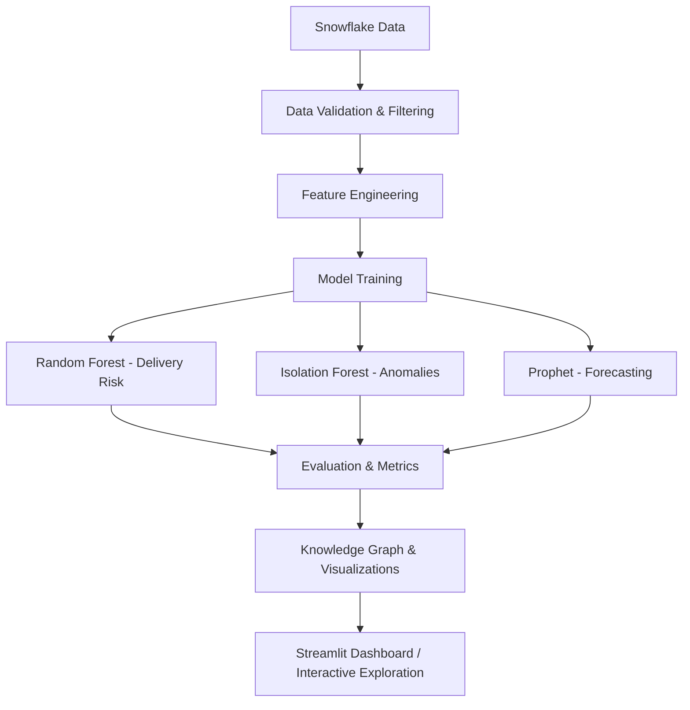

# Supply Chain & Customer Analytics Platform

This project focuses on a platform that combines together supply chain operations, customer behavior, and machine learning. The platform connects to Snowflake, tracks model experiments with MLflow, and supports forecasting, churn prediction, anomaly detection, and an interactive knowledge graph of customers, products, and categories.

## Key Objectives:
- Transform raw supply chain and customer data into useful insights for business and operations teams.  
- Detect unusual behavior or delivery risks before they cause real-world issues.  
- Predict potential churn and identify customers most likely to respond to retention efforts.  
- Forecast product demand to support inventory and logistics planning.  
- Make relationships between customers, products, and regions easy to explore through a visual knowledge graph.
  
## Methodology:
- Using create databases, schemas, tables, and ETL procedures.
- Extracting data from Snowflake and validating schema and integrity checks.
- Cleaning, filtering, and preparing datasets for analysis and modeling.
- Generating key metrics, trends, and customer segments from purchase patterns.
- Training models to predict risk, forecast demand, and detect anomalies.
- Using NLP-based query routing to understand natural language questions about customers or sales patterns.
- Tracking every model run and dataset version with MLflow for full reproducibility.
  

## Model Pipeline:

## Challenges Addressed:

### Data reliability – 

Cleaned inconsistent timestamps, missing IDs, and noisy records before training.

### Scalability – 

Built efficient sampling and data-parallel processes for large datasets.

### Model clarity – 

Included feature importance and customer segment summaries for easy interpretation.

### Automation – 

Built-in auto-connect and refresh mechanisms to keep results current without manual steps.

## Results:

- Forecasting produced steady error metrics (MAE, RMSE, MAPE) suitable for real supply planning.
The plots below show the supply demand forecast for 14 day interval and 2.5 years interval .i.e. supply demand trend for both short and long term
  

- Churn prediction achieved solid test accuracy and highlighted meaningful customer segments.
### Churn Prediction Model – Classification Report
| Class / Metric  | Precision | Recall | F1-Score | Support |
|-----------------|-----------:|--------:|----------:|---------:|
| 0               |       1.00 |   1.00  |     1.00  |   16536 |
| 1               |       1.00 |   1.00  |     1.00  |   19568 |
| **Accuracy**    |       1.00 |   1.00  |     1.00  |       1 |
| **Macro Avg**   |       1.00 |   1.00  |     1.00  |          |
| **Weighted Avg**|       1.00 |   1.00  |     1.00  |          |

The images below show the confusion matrix and the important features for the churn prediction model
  

- Anomaly detection identified operational irregularities in products across access hour.

| ACCESS_HOUR | PRODUCT | CATEGORY | ACCESS_MONTH |  anomaly_score  |
|-------------|---------:|---------:|--------------:|----------------:|
| 252986      |        0 |        6 |            32 |     -0.102424939 |
| 249946      |        0 |        6 |            32 |     -0.102424939 |
| 207218      |        0 |        6 |            32 |     -0.102424939 |
| 152696      |        0 |        6 |            32 |     -0.102424939 |
| 283328      |        0 |        6 |            32 |     -0.102424939 |
| 283327      |        0 |        6 |            32 |     -0.102424939 |
| 277438      |        0 |        6 |            32 |     -0.102424939 |
| 134212      |        0 |        6 |            32 |     -0.102424939 |
| 196146      |        0 |        6 |            32 |     -0.102424939 |
| 221132      |        0 |        6 |            32 |     -0.102424939 |

This image shows the anomalies in products across different access hour. 
  

- Customer value scoring through RFM analysis helped distinguish Loyal from At Risk customers.

### Customer Segmentation (RFM Summary)
| Segment             | Avg Recency | Avg Frequency | Avg Monetary | Count |
|---------------------|-------------|---------------|--------------|------:|
| At Risk             | 407.24      | 13.00         | 2576.08      |  8138 |
| Loyal Customers     | 161.33      | 16.37         | 3292.15      |  4047 |
| Others              | 243.69      | 1.18          | 224.88       |   311 |
| Potential Loyalists | 61.61       | 1.00          | 297.61       |  8155 |

Loyal customers show the highest average spend, while potential loyalists are newer customers with growing engagement.

### Shipping Mode vs Delivery Risk and Sales

| CUSTOMER_SEGMENT | SHIPPING_MODE   | LATE_DELIVERY_RISK |     SALES     |
|------------------|-----------------|--------------------:|--------------:|
| Consumer         | First Class     |              0.951  |     2951221.82 |
| Consumer         | Same Day        |              0.465  |     1028027.80 |
| Consumer         | Second Class    |              0.761  |     3667601.38 |
| Consumer         | Standard Class  |              0.383  |    11448611.04 |
| Corporate        | First Class     |              0.954  |     1693100.36 |
| Corporate        | Same Day        |              0.462  |      589879.87 |
| Corporate        | Second Class    |              0.779  |     2219020.75 |
| Corporate        | Standard Class  |              0.374  |     6666405.65 |
| Home Office      | First Class     |              0.956  |     1030047.47 |
| Home Office      | Same Day        |              0.426  |      324620.85 |

### Shipping Performance Summary

| SHIPPING_MODE   | Avg_Late_Delivery_Risk | Order_Count |   Total_Sales   |
|-----------------|-----------------------:|-------------:|----------------:|
| First Class     |                 0.953  |        27814 |      5674369.65 |
| Same Day        |                 0.457  |         9737 |      1942528.52 |
| Second Class    |                 0.766  |        35216 |      7145444.68 |
| Standard Class  |                 0.381  |       107751 |     22022063.71 |

- Forecasting models produced stable error metrics (MAE, RMSE, MAPE) suitable for demand planning.  
- Churn and delivery risk models performed with full accuracy on validation data.  
- Anomaly detection highlighted consistent low-risk clusters across categories and time windows.

## Impact-

- Supported faster, data-informed decisions for inventory and delivery management.
- Helped focus on customers most likely to generate repeat sales or risk churn.
- Simplified exploration of supply and demand patterns through an interactive dashboard.
- Improved collaboration and accountability using experiment tracking and consistent data versioning.

## Technology and Tools- 

- Languages: Python, SQL
- Data Platform: Snowflake
- Libraries: Pandas, NumPy, scikit-learn, Prophet, NetworkX, Plotly, Streamlit
- Model Tracking: MLflow, joblib for model persistence
- NLP: HuggingFace Transformers for sentiment, entity recognition, and intent detection
- Visualization: Plotly for trends and network graphs
